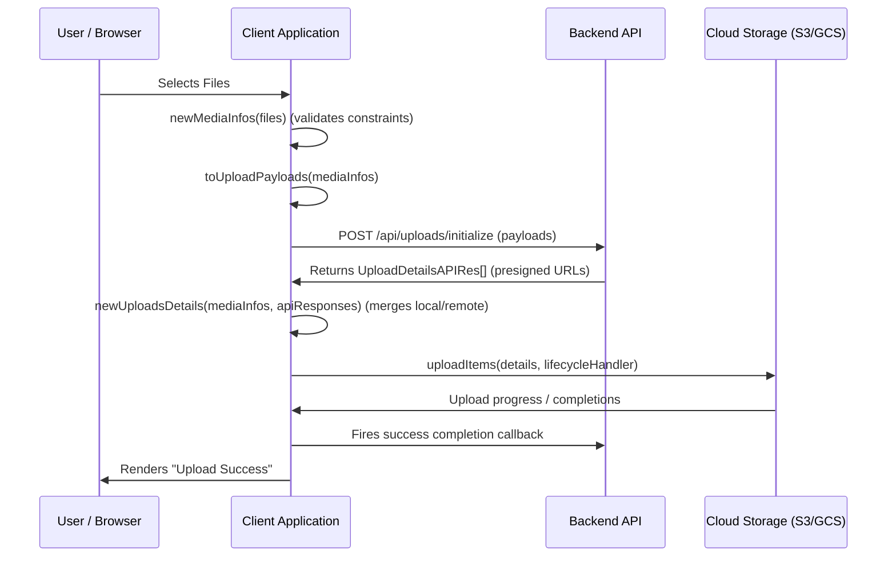

# Media Uploads

Exports from `src/media`.

These helpers manage the complete client-side file upload lifecycle: validating local file selections, converting metadata for the backend API, pairing local file handles with API upload instructions, and executing concurrent, retry-enabled singlepart/multipart S3/GCS direct uploads.

---

## The Complete Upload Lifecycle Flow



---

## Detailed API Reference & Helper Functions

### `newMediaInfo(file)` / `newMediaInfos(files)`

Validates local browser file objects and generates a unique, tracking-safe UUID for each item.

- **`newMediaInfo`**: Validates a single file. Throws `media-too-large` if `file.size > MediaUploadLimit`.
- **`newMediaInfos`**: Validates an array of files. Throws `media-items-limit-exceeded` if `files.length > MediaItemsLimit`.

```ts
import { newMediaInfos } from "adgytec-web-utils";

try {
  const mediaInfos = newMediaInfos(Array.from(inputElement.files || []));
  console.log("Validated media info objects:", mediaInfos);
} catch (error) {
  // Throws ApplicationError (e.g. media-items-limit-exceeded or media-too-large)
  console.error("Selection validation failed:", error.code);
}
```

---

### `toUploadPayload(item)` / `toUploadPayloads(items)`

Prepares media information for the backend authorization request by stripping the local binary `file` references, leaving only metadata fields (`id`, `name`, `size`).

```ts
import { toUploadPayloads } from "adgytec-web-utils";

const apiPayloads = toUploadPayloads(mediaInfos);
// Sent to API: [{ id: "0198a...", name: "photo.jpg", size: 1048576 }]
```

---

### `newUploadDetails(mediaInfo, apiResponse)` / `newUploadsDetails(mediaInfos, apiResponses)`

Merges local `MediaInfo` (containing binary file references) with server-supplied `UploadDetailsAPIRes` structures (containing presigned URLs and upload types).

- Throws an error if local and remote arrays differ in length or if a `mediaID` mapping mismatch occurs.

```ts
import { newUploadsDetails } from "adgytec-web-utils";

// API Response contains presigned singlepart/multipart instructions
const apiResponses = await initUploadsOnServer(apiPayloads);

// Merge binary file handles with the presigned URLs
const uploadItemsList = newUploadsDetails(mediaInfos, apiResponses);
```

---

## Singlepart vs. Multipart Upload Configurations

Cloud storage engines require different endpoints depending on file size.

### 1. Singlepart Upload (Direct Put)
For smaller files, the server returns a single `presignPut` destination URL.

```ts
const singlepartResponse = {
  mediaID: "0198a0e9-903c-7d4f-8246-317022e6523b",
  uploadType: "singlepart",
  presignPut: "https://bucket.s3.amazonaws.com/uploads/0198a0e9?Signature=...",
  singlepartSuccessCallback: "https://api.example.com/uploads/complete/singlepart"
};
```

### 2. Multipart Upload (Chunked Upload)
For larger files, the file is split into predefined byte ranges, and each range gets its own presigned `presignPut` URL.

```ts
const multipartResponse = {
  mediaID: "0198a0e9-903c-7d4f-8246-317022e6523c",
  uploadType: "multipart",
  multipartPresignPart: [
    {
      presignPut: "https://bucket.s3.amazonaws.com/uploads/0198a0e9?partNumber=1...",
      partNumber: 1,
      partSize: 5242880 // 5 MB
    },
    {
      presignPut: "https://bucket.s3.amazonaws.com/uploads/0198a0e9?partNumber=2...",
      partNumber: 2,
      partSize: 5242880
    }
  ],
  multipartSuccessCallback: "https://api.example.com/uploads/complete/multipart"
};
```

---

## Upload Execution & Progress Tracking

The package provides two executor functions:

- **`uploadItem(item, handler, limits?, languageTag?)`**: Uploads a single file.
- **`uploadItems(items, handler, limits?, languageTag?)`**: Uploads multiple files concurrently.

Both functions require a **`LifecycleHandler`** containing status/progress callback handlers.

### Detailed Lifecycle Progress Callback Example

```ts
import { uploadItems, LifecycleHandler } from "adgytec-web-utils";

// Create progress trackers
const fileProgress: Record<string, { uploaded: number; total: number }> = {};

const tracker: LifecycleHandler = {
  // 1. Initializer called before uploading begins
  init: (items) => {
    items.forEach((item) => {
      fileProgress[item.mediaID] = { uploaded: 0, total: item.size };
      console.log(`Starting upload for ${item.mediaID} (${item.size} bytes)`);
    });
  },

  // 2. Multi-part part upload completed successfully
  multipartPartUploaded: (id, uploadedPartsCount, totalPartsCount) => {
    console.log(`File ${id}: Chunk ${uploadedPartsCount}/${totalPartsCount} uploaded.`);
    
    // Update local progress estimators
    const progress = fileProgress[id];
    if (progress) {
      progress.uploaded = Math.min((uploadedPartsCount / totalPartsCount) * progress.total, progress.total);
      triggerProgressBarUpdate(id, progress.uploaded / progress.total);
    }
  },

  // 3. A single file upload succeeded completely
  itemUploaded: (id) => {
    console.log(`File ${id} has uploaded successfully.`);
    triggerProgressBarUpdate(id, 1.0);
  },

  // 4. Temporary error occurred; helper will retry automatically
  uploadRetrying: (id) => {
    console.warn(`Upload failed for item ${id}. Retrying...`);
  },

  // 5. Temporary chunk error occurred; helper will retry automatically
  multipartPartUploadRetrying: (id, partNumber) => {
    console.warn(`Chunk ${partNumber} for item ${id} failed. Retrying...`);
  },

  // 6. Hard failure: limit of retries exceeded, item is marked failed
  failed: (id, error) => {
    console.error(`File ${id} failed to upload after retries:`, error);
    markFileAsFailedInUI(id);
  },

  // 7. Overall completion callback
  completed: () => {
    console.log("All queued files have finished processing (either succeeded or failed).");
    showUploadSummaryNotification();
  }
};

// Start uploading with limits
await uploadItems(
  uploadItemsList,
  tracker,
  {
    concurrentUploads: 3, // Upload up to 3 files simultaneously
    retryLimit: 4,        // Retry failed uploads/chunks up to 4 times
  },
  "en-US"                 // Set locale language tag for header matching
);
```

---

## Supporting Type Definitions

### `MediaInfo`
Describes a verified local file target.
```ts
type MediaInfo = {
  id: string;
  name: string;
  size: number;
  file: File;
};
```

### `UploadLimits`
Settings configuring the orchestrator upload queue behavior.
```ts
type UploadLimits = {
  concurrentUploads: number; // Maximum simultaneous HTTP connections
  retryLimit: number;        // Maximum retry attempts for a failing chunk or upload request
};
```

